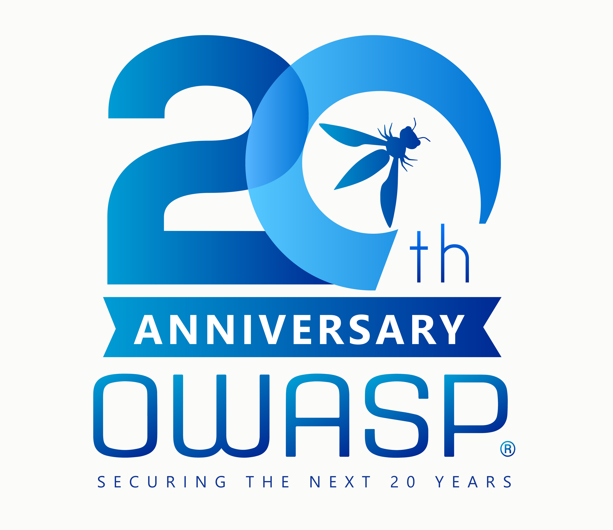

---

layout: col-sidebar
title: OWASP Surabaya
tags: example-tag
region: Asia
country: Indonesia
meetup-group: owasp-surabaya-chapter

---

## Welcome
<blockquote>
On February 15, 2023. the OWASP Global Board voted to change the OWASP® backronym officially from Web to Worldwide. “Resolved that the Foundation will change all current and future references of the ‘Open Web Application Security Project’ to the ‘Open Worldwide Application Security Project.” 
</blockquote>
Selamat datang di Komunitas [OWASP Chapter Surabaya](https://owasp.org/www-chapter-surabaya/). Kami adalah Organisasi Nirlaba yang akan menyelenggarakan beberapa agenda diantaranya pertemuan daring dan luring, baik secara rutin terjadwal sepanjang tahun ataupun dadakan.

Kami sangat berharap dan senang sekali mengundang rekan-rekan seluruh kota-kota di Jawa Timur pada khususnya dan Indonesia Timur pada umumnya untuk bergabung, berbagi pengalaman, pengetahuan dan semua yang terkait, baik langsung ataupun tidak untuk membuat proyek OWASP Surabaya yang menguntungkan semua orang.

Saat ini, OWASP Surabaya telah memiliki beberapa proyek terkait Aplikasi Keamanan Web, diantaranya adalah: KokokBeluk, Internet Monitoring System for Higher Education.

Semua sektor yang ingin berkontribusi dan menjadi sponsor sangat kami persilahkan. Mari berdiskusi dengan kami melalui Email [Surabaya Leaders](mailto:surabaya-leaders@owasp.org).

## OWASP Surabaya Bangga Merayakan Hari Jadi OWASP ke-20.

## Participation
The Open WorldWide Application Security Project (OWASP) adalah lembaga Nirlaba yang bekerja untuk memperbaiki KEAMANAN PIRANTI LUNAK. Semua proyek, peralatan dokumen, pertemuan dan chapter adalah BEBAS dan TERBUKA untuk setiap orang yang tertarik mengembangkan KEAMANAN APLIKASI. 

Chapters diarahkan oleh leaders lokal sesuai dengan [Chapters Policy](/www-policy/operational/chapters). Kontribusi Finansial hanya dilakukan secara daring menggunakan tombol donasi tepercaya. Untuk menjadi PEMBICARA/NARASUMBER pada setiap OWASP Chapter di seluruh dunia menggunakan review sederhana [speaker agreement](/www-policy/legal/speaker-agreement) dan kemudian menghubungi leader chapter lokal dengan menyampaikan secara detil apa yang akan disajikan Proyek OWASP yang dikerjakan, penelitian independen, atau terkait dengan topik KEAMANAN PIRANTI LUNAK.

Setiap orang kami persilahkan dan diharapkan berpartisipasi pada [Projects](/projects/), [Local Chapters](/chapters/), [Events](/events/), [Online Groups](https://groups.google.com/a/owasp.org/g/surabaya-chapter){:target='_blank'}, dan [Community Slack Channel](https://owasp.slack.com/){:target='_blank'}. Kami khususnya berpartisipasi khusus pada semua INITIATIVES. OWASP adalah tempat fantastis untuk belajar tentang KEAMANAN APLIKASI, untuk Jaringan, dan untuk membangun reputasi sebagai seorang AHLI. Kami juga mengharapkan anda untuk menjadi [become a member](/membership/) atau sekedar [donation](/donate/) untuk mendukung pekerjaan kami yang berjalan.

[Struktur Organisasi](https://owasp.org/www-chapter-surabaya/#div-structures)

Terima Kasih untuk semua [Para Pendukung](https://owasp.org/www-chapter-surabaya/#div-supporters) kami.

## Next Meeting/Event 
---------------------


